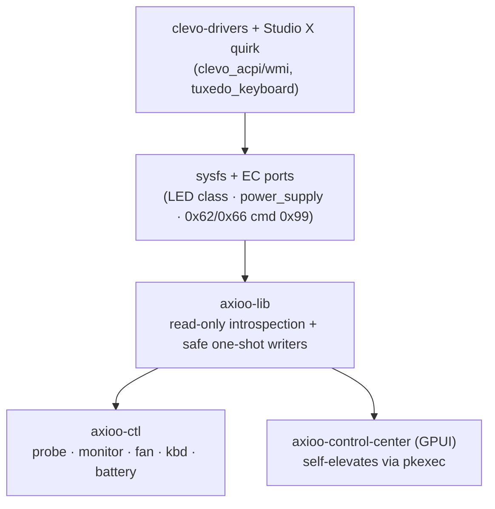

<div align="center">

```
█▌▊▌▐██▌▊▌█▌▌▊██▌▊▌▌█▊▌█▊██▌▊
```

# Axioo Control Center

[](LICENSE)
[]()
[]()


**Linux hardware control for Axioo laptops (Clevo-based) — a from-scratch
Rust replacement for the Windows-only Clevo Control Center.**

*Live sensors · one-shot fan control · 4-zone RGB keyboard · charge limits —
in a dark, mono, keyboard-first UI.*

</div>

Live sensors, one-shot fan control with a draggable curve, 4-zone RGB
keyboard backlight (including the numpad), and charge limits — in a
dark, mono, keyboard-first desktop UI.

## The app

| Tab | 概要 | What you get |
|---|---|---|
| Dashboard | 概要 | CPU/GPU temps, clocks, fans, battery, memory, package power — one glance |
| Performa | 性能 | Quiet → Performance modes, each Auto (curve) / Static (%) / EC-auto |
| Kipas | ファン | Manual duty stepper, **draggable** fan curve, live RPM + EC status |
| Keyboard | キーボード | Per-zone brightness, 7 presets + **custom RGB picker**, live key visualizer |
| Daya | 電源 | Battery, FlexiCharger start/end thresholds, CPU package power |

Session state (mode, curve, duty, keyboard color, tab) persists across
restarts in `~/.config/axioo-control-center/state.json`.

> **Tested only on the Pongo Studio X 2025 (X560WNR-SU9).** Other Pongo
> models are untested: start read-only (`probe`, `fan dump`, `kbd status`)
> and validate your EC/firmware map before writing anything.

## Features

| Area | What works |
|---|---|
| 🌡️ Dashboard | Live CPU/GPU temps, frequencies, fans, battery, memory, RAPL power |
| 🌀 Fan control | One-shot `set`/`auto` (root, clamped 40–100%, both fans, `0xCE`-verified), draggable curve with live snapshot |
| ⌨️ Keyboard | 4-zone RGB (left/center/right/**numpad**), presets + custom RGB picker, per-zone visualizer, brightness steppers |
| 🔋 Charge limit | FlexiCharger start/end thresholds (e.g. 80→90%) via standard kernel API |
| 🖥️ GUI | GPUI desktop app: Dashboard, Performa (Quiet→Performance + Auto/Static/EC), Kipas, Keyboard, Daya |
| 📦 Distro | `script.sh` builds a portable AppImage; `setup.sh` does driver → patch → build → install |

## Quickstart

```sh
# Full setup on a fresh machine (driver + quirk + build + AppImage install):
./setup.sh

# Or manually:
./script.sh                       # release build + dist/*.AppImage
./dist/Axioo-Control-Center-*.AppImage
```

```sh
# CLI:
./target/debug/axioo-ctl probe
./target/debug/axioo-ctl monitor
./target/debug/axioo-ctl fan dump                 # needs root + ec_sys
./target/debug/axioo-ctl kbd status
sudo ./target/debug/axioo-ctl kbd set --preset blue --brightness 255
```

## Driver prerequisite (Pongo)

Install the kernel drivers, then apply the Studio X quirk (firmware
reports backlight type `0x17`, unknown to upstream drivers — no LED
appears without it):

```sh
yay -S clevo-drivers-dkms-git
cd packaging/clevo-drivers-axioo && sudo ./install.sh
ls /sys/class/leds/ | grep kbd   # expect rgb:kbd_backlight{,_1,_2,_3}
```

Details: [`docs/kbd-backlight.md`](docs/kbd-backlight.md).
Without this, every `kbd` command refuses with
"no keyboard-backlight LED found".

## How it works



Safety contract: the EC register map was validated read-only on the
Studio X; writes are one-shot, clamped, and verified. Continuous
curve-following belongs to a future root daemon (`axiood`), never to
ad-hoc writes. See [`AGENTS.md`](AGENTS.md) and
[`docs/ec-fan-protocol.md`](docs/ec-fan-protocol.md).

## Roadmap

- [x] Fan map validation + one-shot control + draggable curve
- [x] Keyboard quirk (0x17 → 3-zone + numpad via EC `0x0B`) + GUI panel
- [x] FlexiCharger thresholds + AppImage + session persistence
- [ ] `axiood` daemon (continuous curve/cap loop, D-Bus) — enables "max 50%" semantics
- [ ] CPU/GPU profiles (RAPL, cpufreq, NVIDIA)
- [ ] Fn-key binds in Hyprland (`kbd brighter/dimmer` is ready)
- [ ] AUR packaging + upstream quirk to clevo-drivers

## FAQ

**Why root?** EC port I/O (`ioperm`) and LED/threshold sysfs need it.
The GUI asks once at startup via `pkexec`, then writes directly —
no repeated prompts.

**Why is my 4th keyboard zone dark?** You need the Studio X quirk
(see Driver prerequisite above): zone 4 (numpad) lives at EC index
`0x0B`, reachable only through our patched driver.

**Will this brick my EC?** Writes are one-shot, range-clamped, and go
through firmware-mediated paths; the map was validated read-only on
the Studio X. Other models: validate read-only first.

## Hardware support

| Model | Status |
|---|---|
| Pongo Studio X 2025 (X560WNR-SU9) | ✅ tested: fan map, 4-zone kbd, charge limits |
| Other Pongo / Clevo | ❌ untested — validate read-only first |

## Credits

Built on community Clevo/Axioo Linux work:

- **[hajilok/clevo-axioo-dual-fan-linux](https://github.com/hajilok/clevo-axioo-dual-fan-linux)**
  — dual-fan EC protocol (`cmd 0x99`, RPM/temp registers, auto curve).
- **[kkrdwn/pongo725-backlight](https://github.com/kkrdwn/pongo725-backlight)**
  — keyboard RGB preset/brightness logic.
- **[System76 clevo-acpi](https://github.com/pop-os/system76-dkms)**
  — documented the numpad EC zone byte (`0x0B`).
- [tuxedo-drivers](https://github.com/tuxedocomputers/tuxedo-drivers) /
  [tuxedo-keyboard](https://github.com/tuxedocomputers/tuxedo-keyboard) —
  kernel drivers underneath it all.

Thanks to all maintainers 🙏 — plus
[novacustom](https://novacustom.com/clevo-keyboard-backlight-control-for-linux/),
[ejcosta](https://github.com/ejcosta/clevo-keyboard-backlight),
[JAmanOG](https://github.com/JAmanOG/colorful-p15-keyboard-backlight) and
[arbitrary-string](https://github.com/arbitrary-string/clevo-control-panel)
whose notes helped crack the 4th zone.

Daemon architecture follows
[tuxedo-rs / tailord](https://github.com/AaronErhardt/tuxedo-rs).

## License

[GNU Affero General Public License v3.0 or later](LICENSE) — free as in
freedom; network use counts as distribution, so hosted/modified builds
must share source under the same terms.
